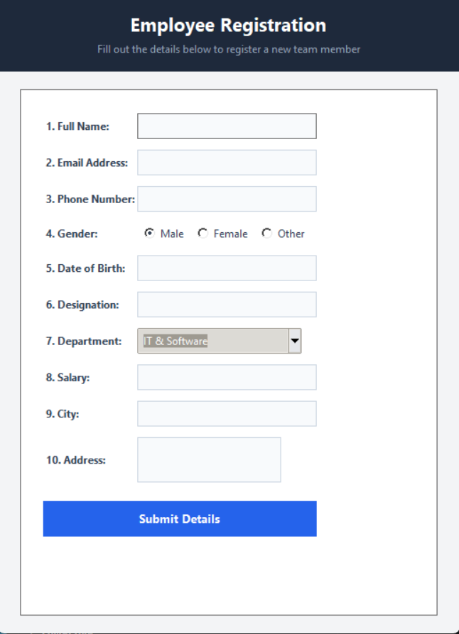

# :male-office-worker: Python Employee Registration Form

A clean, modern desktop GUI application for managing employee onboarding and details. Built using Python, Tkinter, and standard Object-Oriented Programming (OOP) principles with input validation.

---

## :camera_with_flash: Preview



---

## :sparkles: Features

- **Modern Slate UI:** Clean card layout with high-contrast, professional styling.
- **10 Core Detail Fields:** Covers full employee lifecycle info (ID, Name, Email, Phone, Dept, Designation, DOJ, Salary, Gender, Address).
- **OOP Architecture:** Modular structure separating layout logic, styling, and event handling.
- **Client-Side Validation:** Validates required fields, checks for proper email syntax, and enforces numeric salary input.
- **State Reset:** Quick form reset option after submission or via manual trigger.

---

## :hammer_and_wrench: Tech Stack

- **Language:** Python 3.x
- **GUI Toolkit:** Tkinter & `ttk`
- **Pattern:** Object-Oriented Programming (OOP)

---

## :rocket: Getting Started

### Prerequisites

Make sure you have Python installed:
```bash
python --version